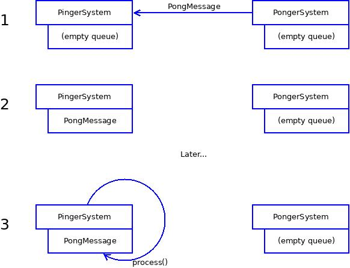

Messages
========

> Attention! Before reading this tutorial, it's highly recommended to read [the "Command" chapter](https://gameprogrammingpatterns.com/command.html) of Bob Nystrom's awesome "Game Programming Patterns" book.

---------------

It's great that systems are decoupled, but there should be something that would allow them to work together. Since systems know nothing about each other (except systems' names and existence), we cannot just write `systems.get("video").draw("cube")` and `systems.get("physics").setPosition(cube, 0, 0, 0)`. Instead, we can send  a `Message` from one system to another.

`Message` is just an object with minimal required information to describe some event or command. One could create custom messages by subclassing `Message` class or its subclasses.

Messages examples
-----------------

Let's have a look at some messages you could create during development.

Imagine you build a platformer game, and you want the character to jump when player presses space key. The message sent from `input` to `physics` system would look like

```nim
type PlayerJumpMessage* = object of Message
```

It may be surprising that it is an empty object. One may say that we need some pointer to player entity, but in fact physics system should already know which entity belongs to player, so this info is redundant. Remember, try to keep messages as small as possible.

```nim
type
  Direction* = enum
    left, right

  PlayerMoveMessage* = object of Message
    direction: Direction
```

Here we need some field to encapsulate player direction. Of course the character can move all directions (pressing space and right arrow would make him move and jump, thus moving up-right), but in terms of player controls there are only jump, right and left movements.

Sending and processing messages
-------------------------------

You can create and send messages whenever you like, in every part of code. Usually messages are created as a reaction to some event or some other messages.

Messages are sent to systems only. Each system can receive a message (or deny it) and then process it.

Ping-pong app
-------------

Let's build a very simple "ping-pong" app with two systems which will infinitely send "ping" and "pong" messages to each other. Also, let's increase some counter in each message.

Our project structure will look like this:

```
ping_pong.nimble
ping_pong.nims
ping_pong.nim
messages.nim
systems
  |_pinger.nim
  |_ponger.nim
```

* `ping_pong.nimble` is a package with project description for `nimble` package manager; it's also a hack, without it your `messages.nim` file name will clash with `c4/messages.nim` file
* `ping_pong.nims` - compilation settings, described later
* `ping_pong.nim` is the main file where we configure `Cat 400` and run it
* `messages.nim` is a place for all our messages; we will have 2 messages, thus it's fine to have a single file, but if your project is large it's better to create multiple messages files in `messages` folder
* `systems/pinger.nim`, `systems/ponger.nim` - each system definition lives in its own file

Basic setup
-----------

First, define all messages that we will use:

```nim
# messages.nim
import strformat

import c4/messages


type
  PingMessage* = object of Message
    cnt*: int

  PongMessage* = object of Message
    cnt*: int

method `$`*(self: ref PingMessage): string =
  &"PingMessage ({self.cnt})"

method `$`*(self: ref PongMessage): string =
  &"PongMessage ({self.cnt})"

```

The definition is quite obvious. Of course, sending messages count is quite useless, but we use it to understand how data is sent between systems.

> Try to always define custom `$` method for every type you create. This will help debugging a lot. Otherwise `c4`'s debug messages will have no meaning.

Now we gonna define our systems. `PingerSystem` will send `Ping` messages to `PongerSystem`, the latter will send `Pong` messages as a response.

```nim
# systems/pinger.nim
import c4/systems

import ../messages


type PingerSystem* = object of System

method `$`*(self: ref PingerSystem): string =
  "PingerSystem"
```

Game loop flow
--------------

Here we need some understanding of how systems receive messages. When you send `PongMessage` to `PingerSystem`, the latter immediately stores this message in its message queue. By default all incoming messages will be stored in system's message queue.

When it's `PingerSystem`'s turn to be updated, main game loop calls `PingerSystem.update(dt)` and that method calls `process()` on every message in message queue.



So, to summarize:

* Main game loop infinitely goes through each system in `config.systems` and calls `System.update(dt)`. In our case, it will call `PingerSystem.update(dt)`, `PongerSystem.update(dt)`, `PingerSystem.update(dt)` etc.

> Game loop respects the order of your systems and will update them in the same order as you registered them.

* By default, `System.update(dt)` does only 1 thing: it pulls messages from message queue and calls `System.process(message)` on them.

> `System.update(dt)` respects the order in message queue: if system received `messageA` and then `messageB`, then it's guaranteed that `messageA` will be processed before `messageB`.

Let's create a rule: when `PingerSystem` processes `PongMessage`, it sends `PingMessage` back (with increased counter).

Here's how we do that:

```nim
# systems/pinger.nim
# ...

method process(self: ref PingerSystem, message: ref PongMessage) =
  (ref PingMessage)(cnt: message.cnt + 1).send("ponger")
```

`(ref PingMessage)(cnt: message.cnt + 1)` is a creation of new `ref PingMessage` with field `cnt` increased by `1`. Also note that we can retrieve any system using `systems.get(<system_name>)`.

That's it! The only problem is that we use `method` here, which means that we need enable `--multimethods:on` compiler switch. You can call it like `nim c --multimethods:on ...`, but `ping_pong.nims` is a better place.

```nim
# ping_pong.nims
switch("multimethods", "on")
```

However, there's even a better way to define `ping_pong.nims`. Some `C4` modules requre additional compiler configuration / switches, and in such cases module will have a `.nims` file with same name. This way you don't need to know all configuration flags required by a specific module - instead you just import module's configuration file into you main `<project>.nims` file, and that's it!

By default `C4` heavily relies on multimethods, so they are switched on in [default configuration file](../../../c4.nims). So let's just include default config file:

```nim
# ping_pong.nims
include "c4.nims"  # include this in every C4 project

# here you can put your own project-specific settings
```

It's up to you to create `systems/ponger.nim` which should be absolutely symmetrical to `systems/pinger.nim` defined above.

Registerning systems
--------------------

Now we need to run our systems in `c4`:

```nim
# ping_pong.nim
import tables

import c4/core
import c4/systems

import systems/pinger
import systems/ponger


when isMainModule:
  core.run(
    serverSystems={
      "pinger": PingerSystem.new().as(ref System),
      "ponger": PongerSystem.new().as(ref System),
    }.toOrderedTable(),
  )

```

Now compile & run the project.

> We registered both our systems on server process, thus we don't need to run client process at all. That's why we add `--mode=server` flag.

```
> nim c -r ping_pong --mode=server -l=debug
...
[2019-04-19T23:07:12] server DEBUG: Version 0.1.1-227
[2019-04-19T23:07:12] server DEBUG: Starting server process
[2019-04-19T23:07:12] server DEBUG: Initializing pinger
[2019-04-19T23:07:12] server DEBUG: Sending SystemReadyMessage(sender: ..., recipient: ...) to PingerSystem
[2019-04-19T23:07:12] server DEBUG: Initializing ponger
[2019-04-19T23:07:12] server DEBUG: Sending SystemReadyMessage(sender: ..., recipient: ...) to PongerSystem
[2019-04-19T23:07:12] server DEBUG: Starting main loop
[2019-04-19T23:07:12] server DEBUG: PingerSystem processing SystemReadyMessage(sender: ..., recipient: ...)
[2019-04-19T23:07:12] server WARN: PingerSystem has no rule to process stored SystemReadyMessage(sender: ..., recipient: ...), ignoring
[2019-04-19T23:07:12] server DEBUG: PongerSystem processing SystemReadyMessage(sender: ..., recipient: ...)
[2019-04-19T23:07:12] server WARN: PongerSystem has no rule to process stored SystemReadyMessage(sender: ..., recipient: ...), ignoring
```

What happened?

* Each system was initialized, and after initialization each system received `SystemReadyMessage` and stored it in message queue.
* Main loop started, it called `PingerSystem.update(dt)`. The update method picked `SystemReadyMessage` from message queue and tried to process it, but we have no rule for it, thus we got a warning.
* Then the same happened to `PongerSystem`.

Ignition
--------

We taught our systems to answer `PingMessage` when processing `PongMessage`, and vice versa. But none of them _received_ a message, there's no one who sent the first message. We gonna fix it.

We know that by the time when `PongerSystem` receives `SystemReadyMessage`, all systems are initialized. Let's make this event a sign to throw first message:

```
# systems/ponger.nim
# ...

method process(self: ref PongerSystem, message: ref SystemReadyMessage) =
  # send first message
  (ref PongMessage)(cnt: 0).send("pinger")
```

Now compile the project:

```
> nim c -r ping_pong --mode=server -l=debug
...
[2019-04-19T23:24:22] server DEBUG: PongerSystem processing SystemReadyMessage(sender: ..., recipient: ...)
[2019-04-19T23:24:22] server DEBUG: Sending PongMessage (0) to PingerSystem
[2019-04-19T23:24:22] server DEBUG: PingerSystem processing PongMessage (0)
[2019-04-19T23:24:22] server DEBUG: Sending PingMessage (1) to PongerSystem
[2019-04-19T23:24:22] server DEBUG: PongerSystem processing PingMessage (1)
[2019-04-19T23:24:22] server DEBUG: Sending PongMessage (2) to PingerSystem
[2019-04-19T23:24:22] server DEBUG: PingerSystem processing PongMessage (2)
[2019-04-19T23:24:22] server DEBUG: Sending PingMessage (3) to PongerSystem
[2019-04-19T23:24:22] server DEBUG: PongerSystem processing PingMessage (3)
[2019-04-19T23:24:22] server DEBUG: Sending PongMessage (4) to PingerSystem
[2019-04-19T23:24:22] server DEBUG: PingerSystem processing PongMessage (4)
[2019-04-19T23:24:22] server DEBUG: Sending PingMessage (5) to PongerSystem
...
```

Awesome! We just set up systems that communicate by sending messages and reacting on them. While it may seem a bit complicated, it's definitely worth it because your systems are truly independent, your code is not tangled and you now have a lot of opportunities like sending messages over network or saving them in order to reproduce ("playback") user inputs.
