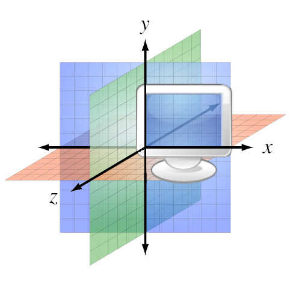
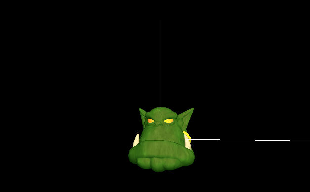

# Video system

While you can create your own systems for every aspect of your game, `C4` comes with some default ones for physics, video, network etc. They are extremely handy for quick start, but you are free to replace any of them with your favorite one.

This tutorial will cover built-in video system.

## Is 2D supported?

Yes and no.
`C4` is a _framework_, which means that you can use any backend for any of your systems. So, unlike game _engines_, you can make a 2D, 3D or even [4D](https://www.youtube.com/watch?v=0t4aKJuKP0Q) game.

However, currently only 3D video backend is included. If you want 2D you should write your own backend (which is rather easy if you follow this tutorial) or search for third-party one.

## C / Horde3d

Originally, `C4` was using [Horde3d](http://horde3d.org/) as default backend for its video system. It is a lightweight 3D rendering engine with small `C` API. It's extremely easy to set up and use, so it's excellent for prototyping.

However, lack of updates and tiny API make working with `Horde3d` unpleasant on big projects. We won't cover the backend in this tutorial.

The sources may be found at [c4/systems/video/horde3d.nim](../../../c4/systems/video/horde3d.nim). 

## C++ / Ogre3d

[Ogre3d](http://www.ogre3d.org) is a mature `C++` 3D engine with a lot of features and documentation. It is a default video backend for `C4`. However, since it's written in `C++`, you will have to use `cpp` backend for `nim`, i.e.

```sh
nim cpp ...
```

Let's see how it works. Understanding it will help you using other backends or even creating your own one.

### Pre-installation

Before understanding video system, let's ensure that we can compile & run it.

First, you need to ensure that all required libraries are installed in your system. Ogre video backend requires:
* SDL 2.*
* Ogre 1.*

Install those using your package manager or whatever:

```sh
# Ubuntu / Debian
sudo apt-get install libsdl2-2.0 libogre-1.9-dev

# Arch
sudo pacman -S sdl ogre
```

`C4` already includes partial bindings for Ogre in [c4/lib/ogre/ogre.nim](../../../c4/lib/ogre/ogre.nim), but for sdl2 you need to install [sdl2_nim](https://github.com/Vladar4/sdl2_nim):

```sh
nimble install sdl2_nim
```

### Basic setup

> Source code for basic setup is available at [src/01-base](src/01-base) folder.

`SDL2` requires defining video driver flags for specific platform. It will be done automatically if you include [ogre.nims](../../../c4/systems/video/ogre.nims) config file:

```nim
# main.nims
include "c4.nims"
include "c4/systems/video/ogre.nims"
```

Time to create `main.nim` file:

```nim
import tables

import c4/core
import c4/systems
import c4/systems/video/ogre

when isMainModule:
  core.run(
    clientSystems={
      "video": VideoSystem.new().as(ref System),
    }.toOrderedTable(),
  )
```

Here we imported `c4/systems/video/ogre` - it defines default `VideoSystem` which does nothing except opening a black application window.

Now check that our setup works:

```sh
# pay attention to "cpp" here!
nim cpp -r main.nim -l=debug
```

If you don't see a black window, [open an issue](../../../issues/new).

### Customization

> Source code for custom setup is available at [src/02-custom](src/02-custom) folder.

#### Define custom video system

Since we want to display _something_, we have to extend default `VideoSystem`:

```nim
# systems/video.nim
import logging

import c4/systems
import c4/systems/video/ogre

type CustomVideoSystem* = object of VideoSystem

method init(self: ref CustomVideoSystem) =
  # call base method, which will perform default initialization
  procCall self.as(ref VideoSystem).init()

  # write something to ensure custom `init()` is called
  logging.debug "Initializing custom video system"
```

`as()` template is nothing but type convertion, so `self.as(ref VideoSystem)` equals to `(ref VideoSystem)(self)`.

`procCall self.as(ref VideoSystem).init()` calls base method (i.e. `VideoSystem.init()`). When customizing some method, almost always it's a good idea to call base method first, unless you know how it works and have specific reasons to overwrite it.

Now replace default `VideoSystem` with our custom one:

```nim
# main.nim
import tables

import c4/core
import c4/systems

import systems/video


when isMainModule:
  core.run(
    clientSystems={
      "video": CustomVideoSystem.new().as(ref System),
    }.toOrderedTable(),
  )
```

Ensure that custom video system is used:

```sh
> nim cpp -r main.nim -l=debug
...
[2019-08-14T08:12:15] client DEBUG: Ogre initialized
[2019-08-14T08:12:15] client DEBUG: Initializing custom video system
...
```

#### Assets

Models, shaders, textures - all these things are required for Ogre to work. It's up to you to manage assets - create a directory, collect and load all types of resources your game needs. `Cat 400` doesn't have any general-purpose asset manager.

Here we will use Ogre's built-in resources manager and a `defautMediaDir` const defined in [c4/lib/ogre/ogre.nim](../../../c4/lib/ogre/ogre.nim) (which points to folder with default Ogre assets). Resources manager is automatically initialized and can be accessed as `self.resourcesManager`, see Ogre documentation for detailed instructions on how to use it.

```nim
# systems/video.nim
import logging
import os  # required for `/` proc

import c4/systems
import c4/systems/video/ogre
# in order to use ogre bindings like `self.resourceManager.addResourceLocation`, 
# we have to import `c4/lib/ogre/ogre` module;
# to avoid name clash with `c4/systems/video/ogre`, we use `import ... as ...`
import c4/lib/ogre/ogre as ogre_lib

type CustomVideoSystem* = object of VideoSystem

method init(self: ref CustomVideoSystem) =
  # call base method, which will perform default initialization
  procCall self.as(ref VideoSystem).init()

  # write something to ensure custom `init()` is called
  logging.debug "Initializing custom video system"

  logging.debug "Loading custom video resources"
  
  self.resourceManager.addResourceLocation(defaultMediaDir / "packs" / "SdkTrays.zip", "Zip", resGroup="Essential")
  self.resourceManager.addResourceLocation(defaultMediaDir, "FileSystem", resGroup="General")
  self.resourceManager.addResourceLocation(defaultMediaDir / "models", "FileSystem", resGroup="General")
  self.resourceManager.addResourceLocation(defaultMediaDir / "materials" / "scripts", "FileSystem", resGroup="General")
  self.resourceManager.addResourceLocation(defaultMediaDir / "materials" / "textures", "FileSystem", resGroup="General")
  self.resourceManager.initialiseAllResourceGroups()
```

Scene manager is available at `self.sceneManager`, let's use it to create light:

```nim
  self.sceneManager.setAmbientLight(initColourValue(0.5, 0.5, 0.5))

  let light = self.sceneManager.createLight("MainLight");
  light.setPosition(20.0, 80.0, 50.0);
```

#### Video component

We need to create Ogre nodes and attach 3d models to them. Of course we could instantiate a model right in `CustomVideoSystem.init()` method, but a better way is to make model "belong" to some entity, i.e. create a _video component_ of entity - this way we can create as much entities as we want, and optionally attach & display their components.

Default `VideoSystem` already defines a `Video` component which automatically adds a `ogre.SceneNode` to the scene. Let's define custom  component inherited from the default one. It will load "ogrehead" mesh and attach it to component's node:

```nim
# systems/video.nim
type
  CustomVideo* = object of Video

method attach*(self: ref CustomVideo) =
  # call base method which creates `self.node`
  procCall self.as(ref Video).attach()

  # get reference to video system
  let videoSystem = systems.get("video").as(ref CustomVideoSystem)

  # create Ogre entity (not to be confused with c4's entity)
  let entity = videoSystem.sceneManager.createEntity("ogrehead.mesh")

  # attach Ogre's entity to node
  self.node.attachObject(entity)
```

Now when we attach `CustomVideo` component to any entity, new Ogre node is created and attached to main scene.

> If you component uses any external resources, never forget to release them when component is detached (i.e. define custom `detach()` method). Default `Video` component automatically removes scene node when detached, so we don't need to define `CustomVideo.detach()` method.

#### Entities creation

In order to display something, we need to create entities and attach `CustomVideoComponent`s to them. Let's do it after video system is initialized. When any system finishes initializing, it receives `SystemReadyMessage`, and right at this moment we can create all our entities:

```nim
# systems/video.nim
import c4/entities

# ...

method process(self: ref CustomVideoSystem, message: ref SystemReadyMessage) =
  let ogre = newEntity()
  ogre[ref Video] = new(CustomVideo)
  ogre[ref Video].node.setPosition(0, 0, -300.0)
```

Use following image to understand Ogre's coordinate system:



By default, our camera is located at `(0, 0, 0)` and watching at `(0, 0, -1)` point. That's why we put out entity at `(0, 0, -300)` - it will be located in front of camera, not too close and not too far away:



